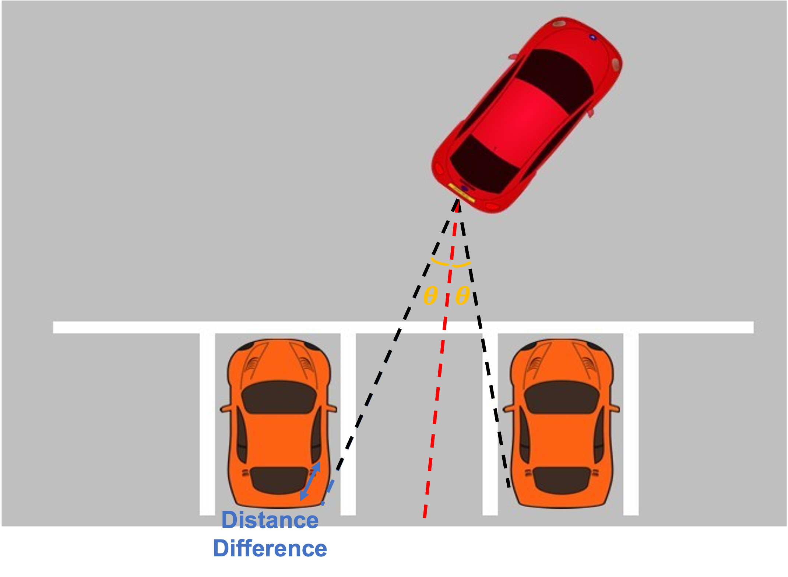

## Abstract
We designed an autonomous driving vehicle by modifying a toy car using Arduino and a PC. In the Autonomous Driving SW Contest, our performance was evaluated based on following missions: **1) Road following**, **2) Obstacle avoidance**, **3) Traffic light recognition**, and **4) Autonomous parking**.

Leveraging Python and PyTorch, we developed an effective methodology to successfully complete aforementioned missions and achieved **2nd Place** in the competition.

 

## Method
#### 1. Road following
- **Preprocessing**: We calibrated the camera to capture the road image and applied a Gaussian filter to remove noise.
- **Control**: We used a Canny edge detector to detect the road boundary and computed the steering angle based on the road gradient.

<!-- #### 2. Obstacle avoidance
- **Object Detection**: We trained a YOLOv5 model to detect obstacles in the front of the car.
- **Control**: We used the detected bounding box to calculate the steering angle and avoid obstacles.
 -->

  

    <h4>2. Obstacle avoidance</h4>
    <ul>
      <li><strong>Object Detection:</strong> We trained a YOLOv5 model to detect obstacles in the front of the car.</li>
      <li><strong>Control:</strong> We used the detected bounding box to calculate the steering angle and avoid obstacles.</li>
    </ul>
  

  

    
  

<!-- #### 3. Traffic light recognition
- **Object Detection**: We trained a YOLOv5 model to detect traffic lights.
- **Control**: We used the detected bounding box to recognize the traffic light color and control the car accordingly.
 -->

  

    <h4>3. Traffic light recognition</h4>
    <ul>
      <li><strong>Object Detection:</strong> We trained a YOLOv5 model to detect traffic lights.</li>
      <li><strong>Control:</strong> We used the detected bounding box to recognize the traffic light color and control the car accordingly.</li>
    </ul>
  

  

    
  

<!-- #### 4. Autonomous parking
- **Parking Slot Detection**: We used LiDAR sensors to detect parking slots.
- **Control**: We designed the parking algorithm to compute the steering angle for autonomous parking.
 -->

  

    <h4>4. Autonomous parking</h4>
    <ul>
      <li><strong>Parking Slot Detection:</strong> We used LiDAR sensors to detect parking slots.</li>
      <li><strong>Control:</strong> We designed the parking algorithm to compute the steering angle for autonomous parking.</li>
    </ul>
  

  

    
  

 

## Results
Our autonomous driving vehicle successfully completed all missions and achieved 2nd place in the competition. <ins><a href="https://github.com/kowoonho/Autonomous-driving-contest" style="color: blue;">Our code</a></ins> provides detailed information about our project.

 

