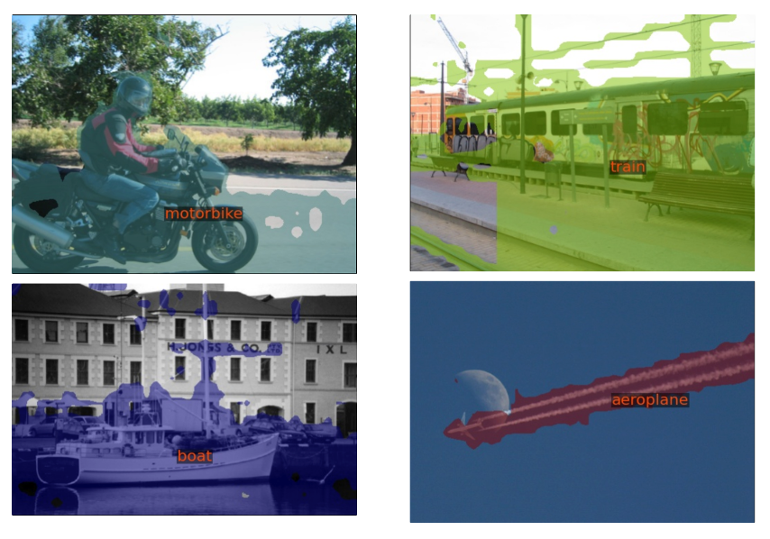
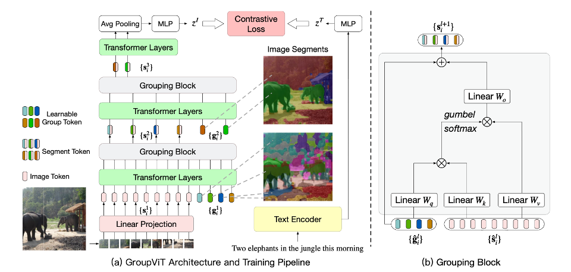
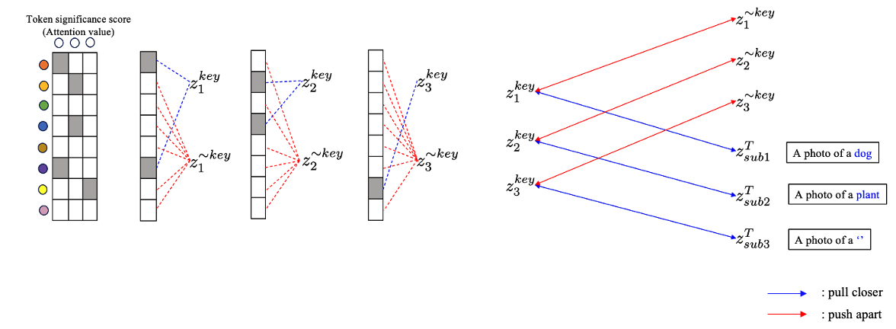
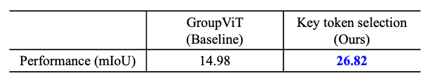

## Abstract
Open-vocabulary semantic segmentation (OVSS) aims to segment objects without relying on predefined categories. In weakly-supervised OVSS (WS-OVSS), the model is trained using only text annotations, without requiring pixel-level labels. However, existing WS-OVSS methods suffer from the **co-occurrence problem**, where objects from different categories that frequently appear together are misclassified as the same category. In this project, I propose a novel method for WS-OVSS that leverages **key token selection** to address the **co-occurrence** problem and improve segmentation accuracy.

 

## Problem Statement

### 1. Co-occurrence Problem
In WS-OVSS, the co-occurrence problem occurs when objects from different categories frequently appear together in the same image, such as a “boat” and the “sea.” As a result, the model may misclassify them as the same category, leading to segmentation errors.

 

## Method
### 1. Preliminary
In this work, I adopt GroupViT as the baseline model for WS-OVSS. GroupViT is a segmentation framework that leverages image-text contrastive learning to train a segmentation network in an open-vocabulary setting.
Specifically, the image encoder uses a vision transformer with a grouping layer to cluster similar image patches into grouping tokens. These grouping tokens are then aggregated via average pooling to form a global image representation. Next, the text encoder gives text representations corresponding to each image. The model is trained using a contrastive objective, bringing matching image-text pairs closer while pushing apart non-matching pairs.
Through this approach, GroupViT enables open-vocabulary semantic segmentation using only text annotations, without requiring pixel-level labels.

### 2. Key Token Selection
However, GroupViT only uses the global image representation for segmentation, which may lead to the co-occurrence problem. Because the global image representation captures the overall image content, it may not adequately distinguish between objects from different categories that frequently appear together. To address this issue, I propose a **Key Token Selection method**. This approach first extracts key words from the corresponding text and identifies relevant grouping tokens based on attention scores. Next, I use a contrastive learning objective, where grouping tokens associated with the same key word are pulled closer, while those related to different key words are pushed apart.

## Results

### 1. Quantitative Results
The proposed method significantly outperforms the baseline GroupViT model in terms of mIoU on the PASCAL VOC dataset, demonstrating the effectiveness of key token selection in addressing the co-occurrence problem. However, the results of each model were trained using the relatively smaller CC3M dataset, whereas the baseline results from the original paper were trained on the combined CC3M + CC12M dataset, leading to some performance differences.

## Conclusion
In this project, I propose a novel method for WS-OVSS that leverages **key token selection** to address the **co-occurrence problem** and improve segmentation accuracy. By incorporating key token selection into the GroupViT framework, the proposed method effectively distinguishes between objects from different categories that frequently appear together, enhancing segmentation performance. The results demonstrate that the key token selection method can mitigate the **co-occurrence problem** in WS-OVSS, providing a promising direction for future research. <ins><a href="https://github.com/kowoonho/OVSS" style="color: blue;">My code</a></ins> provides detailed implementation of the proposed method.

 

